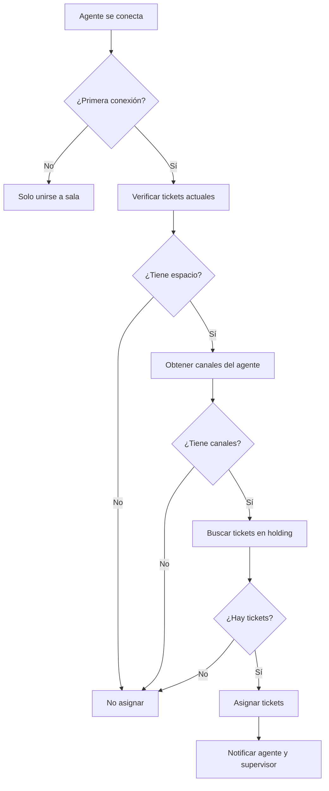

# 🤖 Sistema de Asignación Automática de Tickets

## 📋 Descripción

El sistema de asignación automática asigna tickets en holding a los agentes cuando se conectan, respetando:
- ✅ Máximo **5 tickets por agente**
- ✅ Solo tickets de **canales asignados** al agente
- ✅ Orden **FIFO** (First In, First Out) - los tickets más antiguos primero

## 🔧 Cómo Funciona

### 1. Cuando un Agente se Conecta

```
Agente se conecta → Verificar tickets actuales → Calcular espacios disponibles → Buscar tickets en holding → Asignar automáticamente
```

### 2. Lógica de Asignación

1. **Verificar capacidad actual**
   - Cuenta tickets actuales del agente (status: open, pending)
   - Calcula espacios disponibles (máx 5)

2. **Filtrar por canales**
   - Solo asigna tickets de canales que el agente tiene asignados
   - Ejemplo: Si el agente solo tiene Messenger, no recibirá tickets de WhatsApp

3. **Asignar tickets**
   - Toma los tickets más antiguos primero (FIFO)
   - Asigna hasta llenar la capacidad del agente
   - Notifica al agente y actualiza el supervisor

## 📊 Ejemplos

### Ejemplo 1: Agente con 0 tickets

```
Agente: Juan
Tickets actuales: 0
Canales asignados: [messenger, whatsapp]
Tickets en holding: 7 (3 messenger, 4 whatsapp)

Resultado: Se asignan 5 tickets (los 5 más antiguos)
```

### Ejemplo 2: Agente con 3 tickets

```
Agente: María
Tickets actuales: 3
Canales asignados: [messenger]
Tickets en holding: 10 (5 messenger, 5 whatsapp)

Resultado: Se asignan 2 tickets de messenger (los 2 más antiguos)
```

### Ejemplo 3: Agente sin canales asignados

```
Agente: Pedro
Tickets actuales: 0
Canales asignados: []
Tickets en holding: 10

Resultado: No se asigna ningún ticket (sin canales)
```

## 🎯 Eventos WebSocket

### Eventos Emitidos

1. **`ticket:assigned`** (global)
   ```javascript
   {
     ticketId: 123,
     agentId: 7,
     automatic: true
   }
   ```

2. **`ticket:new_assignment`** (solo al agente)
   ```javascript
   {
     ticketId: 123,
     ticketNumber: "TKT123237",
     contactName: "Fredy Salvador",
     channelType: "messenger"
   }
   ```

## 🔍 Logs

El sistema genera logs detallados:

```
🤖 Iniciando asignación automática para agente 7...
   📊 Agente 7: 0/5 tickets
   📦 Espacios disponibles: 5
   📱 Canales del agente: messenger, whatsapp
   📋 Tickets disponibles para asignar: 3
   ✅ Ticket #TKT123237 asignado a agente 7
      - Contacto: Fredy Salvador
      - Canal: messenger
   🎯 Total asignado: 3 ticket(s)
```

## ⚙️ Configuración

### Cambiar el Máximo de Tickets

Edita `backend/src/utils/autoAssign.js`:

```javascript
const maxTickets = 5; // Cambiar este valor
```

### Deshabilitar Asignación Automática

Comenta estas líneas en `backend/src/server.js`:

```javascript
// if (isFirstConnection) {
//     const { autoAssignTicketsToAgent } = require('./utils/autoAssign');
//     const result = await autoAssignTicketsToAgent(agentId, io);
//     ...
// }
```

## 🐛 Troubleshooting

### Los tickets no se asignan automáticamente

1. **Verificar canales del agente**
   ```sql
   SELECT id, first_name, assigned_channels FROM users WHERE id = 7;
   ```

2. **Verificar tickets en holding**
   ```sql
   SELECT COUNT(*) FROM tickets WHERE assigned_to IS NULL AND status = 'open';
   ```

3. **Revisar logs del servidor**
   - Busca mensajes que empiecen con `🤖`

### El agente recibe tickets de canales no asignados

- Verifica que `assigned_channels` sea un JSON válido
- Ejemplo correcto: `["messenger", "whatsapp"]`

## 📝 Notas Importantes

- ⚠️ La asignación solo ocurre en la **primera conexión**
- ⚠️ Si el agente cierra y abre una pestaña, **no** se reasignan tickets
- ⚠️ Si el agente se desconecta completamente y vuelve a conectar, **sí** se asignan
- ✅ Los tickets se asignan en orden de antigüedad (FIFO)
- ✅ Respeta el límite de 5 tickets por agente
- ✅ Solo asigna tickets de canales permitidos

## 🔄 Flujo Completo



---

**Última actualización**: 2026-01-01
**Versión**: 1.0.0
